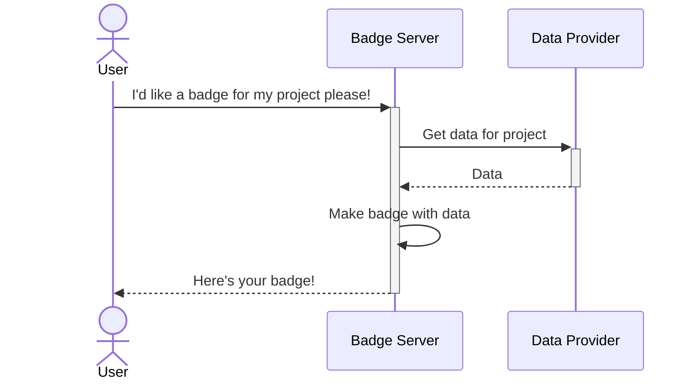

# Integration with upstream services

## Overview

In a nutshell, the Shields Badge Server handles the responsibilities of accepting requests for badges, and then serving those badges back to users.

A grossly oversimplified visualization would probably look something like this:

Shields is not a system of record (we're not the package registry, pipeline tool, etc.) so when Shields receives a request for a badge, the badge server will first have to reach out to the system of record in order to get the data points it needs to create your badge.

For example, if you ask Shields for a build status badge for your CircleCI pipeline, then Shields has to reach out to CircleCI to figure out what the status of your pipeline is (CircleCI would be the "Data Provider" actor in the above diagram). Similarly if you want a badge that shows the count of downloads of your npm package, Shields has to reach out to the npm.js registry.

That covers the gist, but the actual story is a bit more involved and complicated than that of course. There's a number of other components along the way, ranging from the browser on your local machine to extra services and actors we have deployed as part of the Shields.io runtime ecosystem which help ensure we can provide a stable and reliable deployment of the badge server-as-a-service. Additionally, badges rendered in GitHub have some additional factors at play that impose some additional constraints, detailed in the next section.

### GitHub Badge Rendering

A common usage pattern for badges is to embed them in your project's README files so relevant information is conveyed to the project's users. This means badges are often utilized and rendered in source control management platforms, like GitHub.

[GitHub utilizes a proxy service, called camo][camo], for handling the images that you see when you browse project pages on github.com, and this is utilized for badges too (both svg and png formats). GitHub does this for a number of reasons, including to anonymize requests and protect your privacy. However, this also requires the upstream images (including badges) to be returned quickly in order for those images to show up on your screen, with a rough ceiling of 3-4 seconds. If the upstream image provider is too slow to respond, then camo will timeout and the image won't be displayed.

This imposes constraints on Shields, as we need to ensure that the badge server completes the entire request/response workflow and returns the final badge within a few seconds.

[camo]: https://docs.github.com/en/authentication/keeping-your-account-and-data-secure/about-anonymized-urls

## Interaction patterns

Because of the time limits around the full badge flow discussed above, the badge server is somewhat constrained in terms of patterns it can employ to fetch data from the upstream provider. When we incorporate new badges we typically need to ensure when we receive a badge request and need to get data to serve that badge request, that we can get that data by making a single call to the upstream provider to get the data points needed for the badge.

The nature of the call Shields makes to upstream data providers is obviously dependent upon the nature of the upstream endpoints. The overwhelming majority of the time this occurs via a GET request, though there are a few occasions where the upstream endpoint requires a POST in order for us to retrieve data, and a few others where we issue a HEAD request because the data points we need for the badge actually reside in the response headers.

There are a couple other exceptions, but as a general pattern we strive to integrate with services via a stateless, single call manner.

### Authentication

Shields typically integrates with upstream data providers anonymously, largely because the data targets we need are anonymously available (open source packages, repositories, pipelines, etc.)

The badge server can be configured to make authenticated requests for certain supported services. This exists so that users who are [self-hosting] their own instance of the badge server can get badges for their private content, and also as part of agreements we've made with certain upstream data providers for the main Shields.io deployment.

[self-hosting]: ./self-hosting.md

### Rate Limits

Many upstream data providers employ common techniques to protect the availability and integrity of their service, and one common technique is [rate limiting].

Typically, when clients/consumers of rate limited endpoints will employ client-side techniques to avoid running afoul of those limits and potentially getting blocked or having their requests throttled. Unfortunately, those techniques aren't really viable for the Shields.io environment due to the workflow and constraints discussed above.

As such, we instead try to ensure that Shields.io never makes more calls to an upstream provider than their rate limits allow.

In cases where Shields.io may run close to or exceed those limits, we typically consider:

- increasing the cache periods we set (to reduce the number of badge requests we receive)
- collaborating with the vendor or maintainers of the upstream data provider to explore options for an increased rate limit for Shields.io
- decline to provide badges for that upstream data provider

[rate limiting]: https://en.wikipedia.org/wiki/Rate_limiting

### Denial of Service

coming soon...

### Considerations for new upstream integrations

coming soon...
